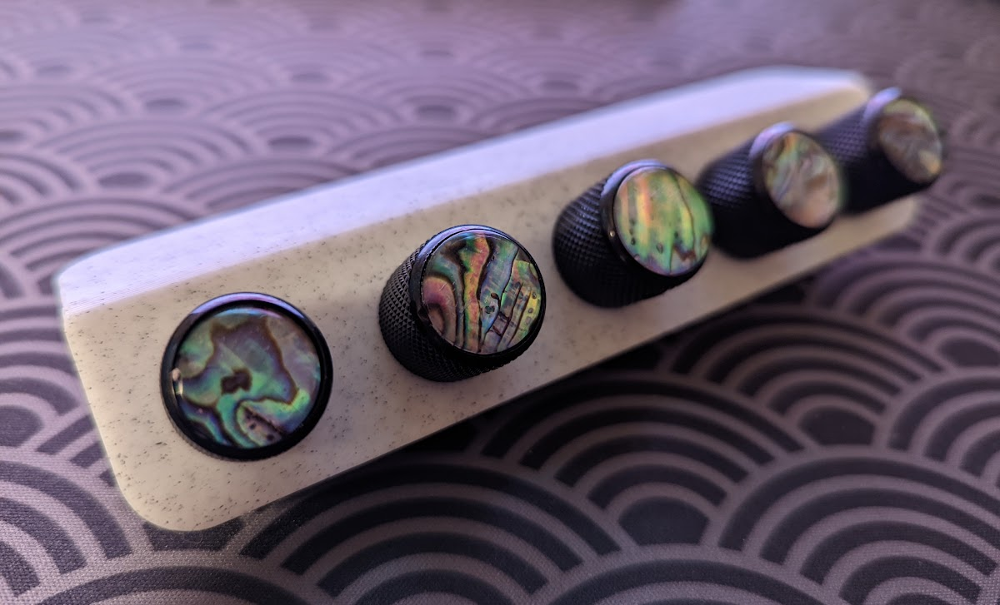
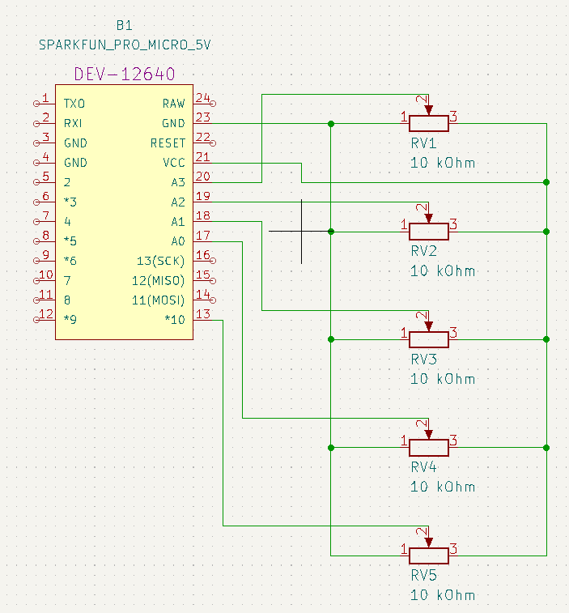
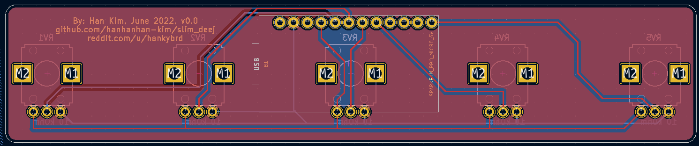
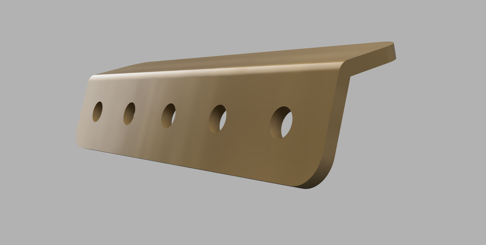
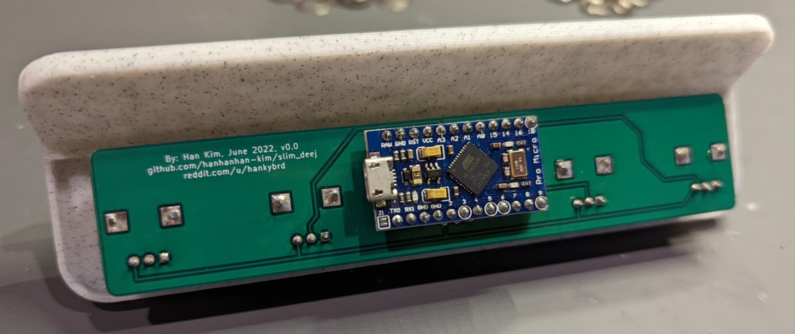
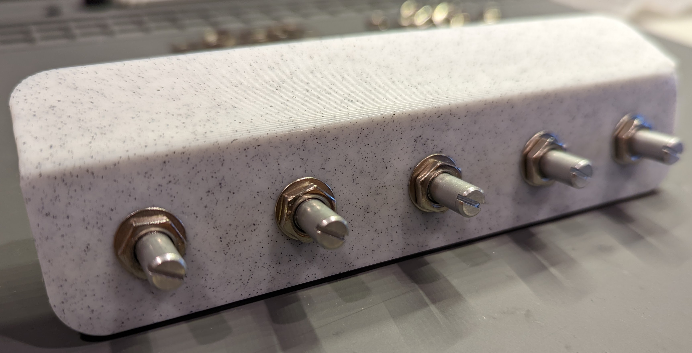

# Slim Deej

*A small form factor Deej that frees up desk space.*

This project provides hardware for the awesome [Deej](https://github.com/omriharel/deej) volume mixer (Windows and Linux only). The Deej community has come up with many myriad designs, but I didn't find one that suited my needs. So I made one! This Deej design is fairly low profile, and can be mounted under one's desk or monitor, so it doesn't take up any valuable desk space. For this reason, I'm using rotary potentiometers, because sliding potentiometers take up a lot of real estate. I also designed a PCB, to ease the assembly process, and slim down the form factor. A slight upward angle on the front panel adds to the aesthetic.

## BOM

In addition to standard electronics equipment and access to a 3D-printer:

| Item                          | Price (USD) | Quantity | Source                                                       |
| ----------------------------- | ----------- | -------- | ------------------------------------------------------------ |
| Arduino Pro Micro*            | 27.99 / 3   | 1        | Amazon [ASIN B01MTU9GOB](https://www.amazon.com/HiLetgo-Atmega32U4-Bootloadered-Development-Microcontroller/dp/B01MTU9GOB/ref=sr_1_1_sspa?dchild=1&keywords=arduino+pro+micro&qid=1614562625&sr=8-1-spons&psc=1&spLa=ZW5jcnlwdGVkUXVhbGlmaWVyPUEyV1BVTFBUNEY2NjhHJmVuY3J5cHRlZElkPUEwMTk3NDQwM1RON1BNTkJSNjBGSyZlbmNyeXB0ZWRBZElkPUEwMzI5Nzg0MlpFV1c0TUtIVElGWSZ3aWRnZXROYW1lPXNwX2F0ZiZhY3Rpb249Y2xpY2tSZWRpcmVjdCZkb05vdExvZ0NsaWNrPXRydWU=) |
| PCB                           | 5.40 / 3    | 1        | [JLCPCB](https://jlcpcb.com/)                                |
| Rotary potentiometer (10 kΩ ) | 2.23        | 5        | [Digikey 987-1666-ND](https://www.digikey.com/en/products/detail/tt-electronics-bi/P0915N-EC15BR10K/4780755?s=N4IgTCBcDaIJwA4DsBaAjANiygdgExAF0BfIA) |
| *Optional*: Knobs             | 0 - lots    | 5        | Can be printed (e.g. [here](https://www.thingiverse.com/thing:54024) or [here](https://www.thingiverse.com/thing:1072393)), or bought. Just make sure it's for 6 mm diameter shafts. Guitar knobs are often of the correct size. |

**Note*: I used an Arduino Pro Micro clone, to cut down on price. Any microcontroller with the ATmega 32U4 processor and a Pro Micro footprint and pinout should be fine, e.g. the [Sparkfun Pro Micro](https://www.sparkfun.com/products/12640). Unfortunately, the supply chain shortage has affected things, and microcontrollers are more expensive than they used to be.

## Circuit

Here's a schematic of the circuit. It's very simple, just a GND rail and a VCC rail, and each potentiometer gets its own analog pin:

Here's the circuit PCB, with a view from the back side: 

The KiCad source files are available [here](./kicad_slim_deej/). 

## Installation

Installation is fairly straightforward. Print the [panel case](./case_front.3mf), a render of which is shown: 

Solder the rotary potentiometers *first*. Then solder the microcontroller onto the other side of the PCB (only one side of the microcontroller pins will be soldered onto the PCB). Make sure the USB port is facing the text, like so:

Then, using the washers and nuts that come with the potentiometers to affix the PCB to the case:

Then, upload the [firmware provided](./arduino_deej_5_knobs/arduino_deej_5_knobs.ino), using the Arduino IDE. This firmware differs from the [one in the official Deej Github repo](https://github.com/omriharel/deej/tree/master/arduino/deej-5-sliders-vanilla), only in that the specified pins correspond to the potentiometers, from left to right on the panel. Finally, download the [Deej software and configuration file](https://github.com/omriharel/deej/releases/tag/v0.9.10) from the official Deej repo, and make sure the Deej configuration file specifies the correct port. Then, edit the configuration file to your heart's desire, and enjoy your Deej! Read the [official Deej docs](https://github.com/omriharel/deej#software) for more details! 

